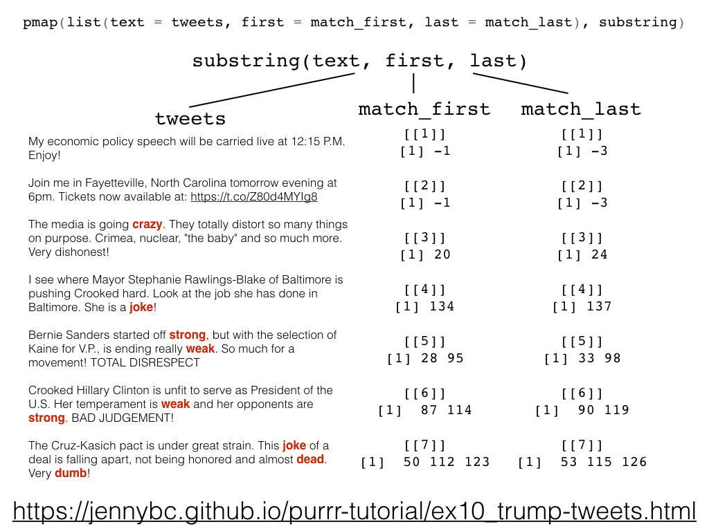

In this homework, I will be working on two tasks: Task1 is to explore `Character data` by working on the exercises in the [Strings chapter of R for Data Science](https://r4ds.had.co.nz/strings.html). Task2 is about working with a list by writing up a lesson from the [purrr tutorial](https://jennybc.github.io/purrr-tutorial/index.html)

To start with, load the necessary R packages as in below. 


```{r}
suppressPackageStartupMessages(library(tidyverse))
suppressPackageStartupMessages(library(stringr))
suppressPackageStartupMessages(library(testthat))
```

#TASK1 : Character data

## Resources

This task was done using the following resources:

1. Mostly [stat545.com: character data](http://stat545.com/block028_character-data.html)
    - See the ["Resources" section](http://stat545.com/block028_character-data.html#resources) for a more comprehensive listing of resources based on the character problem you're facing. 
2. [Older stat545 notes](http://stat545.com/block022_regular-expression.html)
3. [r4ds: strings](https://r4ds.had.co.nz/strings.html).
4. [`stringr` vignette](https://cran.r-project.org/web/packages/stringr/vignettes/stringr.html)

The main focus of the Strings chapter is on `regular expressions`, or `regexps` for short. It focuses on `stringr` package for string manipulation. Functions from `stringr` start with `str_`.

## 14.2.5 Exercises:

### 1. In code that doesn’t use stringr, you’ll often see paste() and paste0(). What’s the difference between the two functions? What stringr function are they equivalent to? How do the functions differ in their handling of NA?

```{r}
#Differences between paste() and paste0()
paste("This", "is", "a", "string") #it seems like paste() has an in-built separator even without specifying or including sep = " " when trying to concatenate string
paste("This", "is", "a", "string", sep = " ") #this is equivalent as to when there is no sep.
```


```{r}
paste("This", "is", "a", "string", sep = "") #this is equivalent as to when we have paste0().
paste0("This", "is", "a", "string") #paste0() has no in-built separator
paste0("This", "is", "a", "string", sep = " ") #no in-built separator and sep = " " is even doing nothing. The use of sep = " " in paste0() has no effect. It only added a space after the characters.
```


```{r}
#The string function they are equivalent to: 

#All these are equivalent.
paste("This", "is", "a", "string", sep = "")
paste0("This", "is", "a", "string")
str_c("This", "is", "a", "string")
str_c("This", "is", "a", "string", sep = "")
```


```{r}
#These are also equivalent. The paste() with and without sep = " " is equivalent to str_c with sep = " ".
paste("This", "is", "a", "string")
paste("This", "is", "a", "string", sep = " ")
str_c("This", "is", "a", "string", sep = " ")
```


```{r}
#How the three functions differ in handling of NA
paste("This", "is", "a", "string", NA) #concatenate strings with separator and populate NA as part of a string
paste0("This", "is", "a", "string", NA) #concatenate strings with no separator and populate NA as part of a string
str_c("This", "is", "a", "string", NA) # only output NA, no concatenation
```


### 2. In your own words, describe the difference between the `sep` and `collapse arguments` to `str_c()`

```{r}
str_c("This", "is", "a", "string", sep = "&") #the words are separated by & but merge into a string

str_c("This", "is", "a", "string", collapse = "&") #no separation between words. collapse merges strings to a string.


Statement1 <- c("Big", "Small")
Statement2 <- c("Dad", "Mom")
str_c(Statement1, Statement2, sep = ";") #separator appears between each element in a vector 
str_c(Statement1, Statement2, sep = ";", collapse = "&") #separator appears between each element in a vector and then collapse & is used to collapse the concatenated strings of two vectors into a string. 
```


### 3. Use `str_length()` and `str_sub()` to extract the middle character from a string. What will you do if the string has an even number of characters?


```{r}
Statement3 <- "This is a string"
str_length(Statement3) #number of characters/alphabets including spaces in Statement3
```


```{r}
str_length(c("a", "R for data science", NA)) #number of characters/alphabets in each words of the string.
str_length("science")# scinece contains 7 characters
```


```{r}
#For non-even number of character
S <- "science"
str_sub(S, str_length(S)/2 +1, str_length(S)/2 +1) #e appears to be the middle character
```


```{r}
#String with even character?
W <- "scienceworld"
str_sub(W, str_length(W)/2, str_length(W)/2 +1) #ce appears to be the middle 2 characters

```

### 4. What does str_wrap() do? When might you want to use it?

```{r}
Paragraph <- "This is a string. Strings can sometimes be separated into words, and sometimes words into characters. It's a lot easier and better to see when we collapse them all"
Paragraph
cat(str_wrap(Paragraph)) #str_wrap is used to break long paragraphs/texts into sentences.

cat(str_wrap(Paragraph, width = 30), "\n") #here we have specified the desired lenght of the sentences. We can use this to fit into a specified paper or space. It also helps to fix long axes labels.
```

### 5. What does `str_trim()` do? What’s the opposite of `str_trim()`?

The opposite of `str_trim` is `str_pad` which allows us to add characters, words, spaces as desired.

```{r}
#str_trim() removes all spaces in the heading, tailing, before and after a string
Statement4 <- "  This is a string  "
Statement4
str_trim(Statement4) #here the spaces are gone, str_trim() removes spaces before and after a string


(num <- str_pad(1:12, width=3, side = "left", pad = "$")) #this makes exactly three chracters and added $ to the left of anyone less than 3 to have all lenght exactly 3  
```

### 6. Write a function that turns (e.g.) a vector c("a", "b", "c") into the string a, b, and c. Think carefully about what it should do if given a vector of length 0, 1, or 2.

```{r}
Vector_to_String <- function(x) {
  if (length(x) ==0) { #return empty string if length is zero
    return("")
  }
  else if (length(x) == 1) { #return "a" if length is 1
    return(x)
  }
  else if (length(x) == 2) { #return "a and b" if length is 2, 
    return(str_c(x, collapse = " and "))
  }
  else {
    initial <- str_c(x[-length(x)], collapse = " , ")
    final <- str_c(initial, x[length(x)], sep = ", and ") #else return "a, b,...,z"
    return(final)
  }
}
```


```{r}
#Check that the function works
Vector_to_String("")
Vector_to_String("a")
Vector_to_String(c("a", "b"))
Vector_to_String(c("a", "b", "c"))
Vector_to_String(c("a", "b", "c", "d"))
#obviously the function works
```


```{r}
#Now test the function with expect_equal
expect_equal(Vector_to_String(c("a", "b")), "a and b")
expect_equal(Vector_to_String(c("a", "b", "c", "d")), "a , b , c, and d")
#No error messages given means the statement is true and they are equal
```


## 14.3.3.1 Exercises:

### 1. Create regular expressions to find all words that:

#### Start with a `vowel`.

```{r}
str_view(words, pattern = "^[aeiou]", match = TRUE) #every words shown below begin with atleast a vowel.
```

#### That only contain `consonants`. (Hint: thinking about matching `“not”-vowels`.)

```{r}
str_view(words, pattern = "[aeiou]", match = FALSE) #Not vowel means only consonants words.
```

#### End with `ed`, but `not` with `eed`

```{r}
str_view(words, pattern = "[^e]ed$", match = TRUE) #obviously all the words listed ended with ed and not eed.
```


#### End with `ing` or `ise`

```{r}
str_view(words, pattern = "ing$|ise$", match = TRUE) #all the words below ended with either ing or ise.
```

### 2. Empirically verify the rule “i before e except after c”.

```{r}
str_view(words, pattern = "[^c]ie|cei", match = TRUE) #it shows that i must come before e in all cases except if it's preceded by c, the e can come before i.
```


### 3. Is “q” always followed by a “u”?

```{r}
str_view(words, pattern = "q[^u]", match = TRUE) #empty output means this statement is true, "q" is always followed by a "u"
```


### 4. Write a regular expression that matches a word if it’s probably written in British English, not American         English.

```{r}
#American English's spelling ends with "or" (e.g color, favor) and British's ends with "our" (e.g colour, favour)
str_view(words, pattern = "our$", match = TRUE) #The output gives British spelling, the $ in front of our means only look for our and stop

str_view(words, pattern = "or$", match = TRUE)  #The output gives American spelling
```


### 5. Create a regular expression that will match telephone numbers as commonly written in your country.

Telephone numbers used in Canada are written as `+1 (XXX) XXX-XXXX`.

```{r}
(tele_number <- c("+1 (788) 321-4867", "+35 (214) 333-1419", "+27 (200) 234-2939", "1-800-111-8888")) #Here I specify 4 different telephone numbers including those from outside Canada.

str_view(tele_number, pattern = "^\\+1 \\([1-9][0-9]{2}\\) [0-9]{3}-[0-9]{4}$", match = TRUE) #here I write a code to pick which one belongs to Canada.

str_view(tele_number, pattern = "^\\+1 \\([0-9]{3}\\) [0-9]{3}-[0-9]{4}$", match = TRUE) #Or write it as this.
```


#TASK2 : Work with a list

Work through and write up a lesson from the [purrr tutorial](https://jennybc.github.io/purrr-tutorial/index.html): 
  
## Trump Android Tweets 
  
This is the basis for a live coding exercise. 

Here is the [link to this section](https://jennybc.github.io/purrr-tutorial/ls08_trump-tweets.html)

Load the necessary R packages as in below:
  
```{r}
library(purrr)
suppressMessages(library(dplyr))
library(tibble)
library(kableExtra)
```
  
  
Load some tweets from the offical Donald Trump account.

```{r}
#load(url("http://varianceexplained.org/files/trump_tweets_df.rda"))
load("trump_tweets_df.rda")
#glimpse(trump_tweets_df)
```  
  

```{r}
#View the first 3 rows of the data frame
trump_tweets_df %>%
  head(n = 3) %>%
  kable() #pipe into kable to have a fancy table
```


```{r}
#Summary gives the types of data, variables they have, the length of their words, the class and the mode. It in general gives the summary of the data.
summary(trump_tweets_df) 
```

```{r}
#structure also gives most info about the data. It states the classes of their variables, the rows/observations, identified if they are in tibble form, know if they are data frame, 
str(trump_tweets_df) 
```

```{r}
tweets <- trump_tweets_df$text #extract variable text from the data frame
tweets %>% head() %>% strtrim(70) #view the first 6 rows of the variable text and trim the length of the string to 70
```

```{r}
#Words associated with Trump tweets from an Android device smushed together into a regular expression.
regex <- "badly|crazy|weak|spent|strong|dumb|joke|guns|funny|dead"
```  


### Extract the Trump Android words `regex` from the `tweets` we've stored.

We can scale down the problem by preselecting rows that have all the complexity we need.

```{r}
tweets <- tweets[c(1, 2, 5, 6, 198, 347, 919)] #selects just 7rows of 1st, 2nd,...,919th rows from tweets 
tweets %>% strtrim(70) #reduce the length of the sentence to width=70
```

Use the base function `gregexpr()` to locate all the Trump Android words inside the `tweets`.

```{r}
matches <- gregexpr(regex, tweets) #matches contains words in tweets that match regex
str(matches) #-1 means no matches found, any number aside -1 means atleast a match was found. No match for tweet 1 & 2, 1 match each for tweet 3 and 4 with character 5 and 4 respectively and so on.
```


```{r}
#Tweet 1 has 0 matching words.
str(matches[[1]]) 
matches[[1]] 
```


```{r}
#Tweet 7 has 3 matching words of 4 characters each in the positions 50, 112 and 123 respectively.
str(matches[[7]]) 
matches[[7]] 
```

### Preview of `substring()` target function

The figure below shows if matches were found or not (-1 if no match found) in each text. It shows the number of words found in each text, the position of the first and last characters of each words.





### How long are the elements of matches?

```{r}
#These give the number of matching words in each tweet. 
lengths(matches)   #just happens to exist for length.
sapply(matches, length) #NSFP = not safe for programming
vapply(matches, length, integer(1)) #preferred base approach
map_int(matches, length) #purrr way
```

### Get a list of the match lengths.

```{r}
#Each element of matches carries this information named "match.length()". Here I am doing it for the last element of matches.
m <- matches[[7]] #store this info in a list 
attr(m, which= "match.length") #get the attribute named "match.length" using "atr()". This gives the number of characters in each of the 3 matching words from tweet 7
```

Applying this logic to the entire matches list:
  
  #### 1. Pre-defined custom function `ml`. Most verbose
  
```{r}
ml <- function(x) attr(x, which = "match.length")
map(matches, ml) #this shows text with matches, the number of words in each text and the number of character in each word. For example, tweet in the 7th row has 3 matching words of 4 characters each, while tweet in the 1st row have no matching word.
```


#### 2.  Anonymous function. Very compact.

```{r}
#This does the same as the function above.
map(matches, ~ attr(.x, which = "match.length"))
```


#### 3.  Pre-existing function with additional arguments passed

```{r}
#We similarly have the same output here as well
(match_length <- map(matches, attr, which = "match.length"))
```

### Count the number of Trump Android words in each tweet

We subset down to 7 tweets, now we want to know how many Trump Android words appear in each tweet. 


```{r}
m <- matches[[1]] #words in tweet one
sum(m > 0) #gives a zero word, no match.

m <- matches[[7]] #words in tweet 7
sum(m > 0) #gives 3 words.

```

### Insert into the machinery

#### 1. Writing functions

```{r}
#This function gives the number of Trump Android words that appear in each tweet.
f <- function(x) sum(x > 0)
map(matches, f)
```

#### 2. Or wrtie it as 

```{r}
#This is a different code doing the same thing as above.
map(matches, ~ sum(.x > 0))
```

The resulting object gives:
  
```{r}
map_int(matches, ~ sum(.x > 0)) #this gives a simpler form of the same info as above. It gives the number of Trump Android words that appear in each tweet.
```

#### Confirm the difference between using `length()` and `map_int()`

From below, we see that `length` gives `1` instead of `0` word when there are no matching words, while `map_int()` give `0` which shows that there is no matching word.

```{r}
tibble(
  naive_length  = lengths(matches),
  n_words = map_int(matches, ~ sum(.x > 0))
)
```

### Strip the attributes from `matches`

```{r}
(match_first <- map(matches, as.vector)) #gives the position of the first character of each Trump Android word in a tweet, -1 means no word.
```

### An example to illustrate all that has been done

```{r}
tweets %>% strtrim(70) #pipe the tweets (consisting of 7 tweets) to reduce the length to 

match_first #gives the position of the first character of each Trump Android words in each tweet

match_length #gives the length(number of character) of each Trump Android words present in each tweet
```

#### 1. Illustrating `tweet7` which contains `3` Trump words.

```{r}
(tweet <- tweets[7]) #this shows the text contained in the 7th tweet
```


```{r}
(t_first <- match_first[[7]]) #shows the position of the first character of each of the 3 Trump words in tweet 7.
```


```{r}
(t_length <- match_length[[7]]) #the length(number of characters) contained in each words respectively
```


```{r}
(t_last <- t_first + t_length - 1) #shows the position of the last character of each of the 3 Trump words in tweet 7.
```


```{r}
substring(tweet, t_first, t_last) #shows the 3 Trump Android words in tweet 7.
```


#### 2. Illustrating `tweet1` which contains `0` Trump words with the same code.

```{r}
(tweet <- tweets[1]) #this shows the text contained in the 1st tweet
```


```{r}
(t_first <- match_first[[1]]) #shows the position of the first character of each of the 0 Trump words in tweet 1. This shows -1 since no match exist.
```


```{r}
(t_length <- match_length[[1]]) #the number of characters contained in each words respectively. Also gives -1 since no word exist.
```


```{r}
(t_last <- t_first + t_length - 1) #gives -3 (-1-1-1)
```


```{r}
substring(tweet, t_first, t_last) #shows the 0 Trump Android words. This gives an empty set since no match exist
```


### Store where Trump words end

Code that shows where the Trump word for a single tweet ends 

first <- an element of matches
length <- an element of match_length
last <- first + length - 1

We also have another map() -type problem, but instead of mapping over one list, we need to map over 2 lists in parallel. Read the help for `purr::map2()!`. It is used as `map2(.x, .y, .f, ...)`

1. Input1 = .x will be first

2. Input = .y will be length

3. Function .f will be something that does first + length -1. 

```{r}
(match_last <- map2(match_first, match_length, ~ .x + .y -1)) #shows the position of the last character of each of Trump words in each tweet.
```

### Extract the Trump words

We also have another map() -type problem, but instead of mapping over one list, we need to map over 3 lists in parallel. There is no map3() and therefore this calls for us to read the help for `pmap()`. It is used as `pmap(.1, .f, ...)`

```{r}
pmap(list(text = tweets, first = match_first, last = match_last), substring) #this gives the Trump words in each tweet
```

### March through the rows in a data frame

Working through the rows in a data frame is `safer` (you can easily subset or reorder all the pieces together without forgeting anyone) and `tidier` (you can print it, view() it, str(), etc to get a sense of how things stand).

```{r}
mdf <- tibble( #this is also doing a similar thing as above but now with a tibble
  text = tweets,
  first = match_first,
  last = match_last
)
pmap(mdf, substring) #this gives the Trump words in each tweet
```

Working from the top using a data frame approach and being as concise as possible.

```{r}
tibble(text = tweets, #this gives the Trump words in each tweet
       first = gregexpr(regex, tweets)) %>%
  mutate(match_length = map(first, ~ attr(.x, which = "match.length")),
         last = map2(first, match_length, ~ .x + .y -1)) %>%
  select(-match_length) %>%
  pmap(substring)
```


## References:

[R for Data science](http://r4ds.had.co.nz/factors.html)

[STAT547 class exercise102 and note](http://stat545.com/Classroom/notes/cm102-exercise.nb.html)

[Simplifying data from a list of GitHub users](https://jennybc.github.io/purrr-tutorial/ls02_map-extraction-advanced.html)